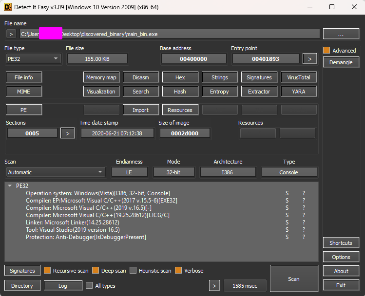
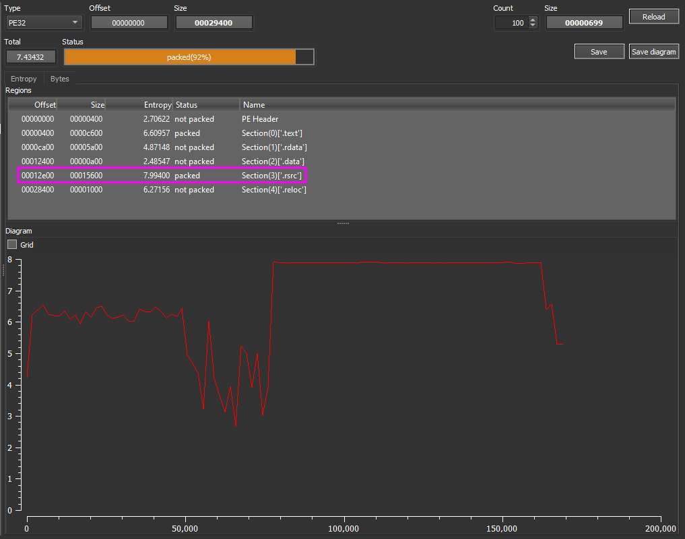
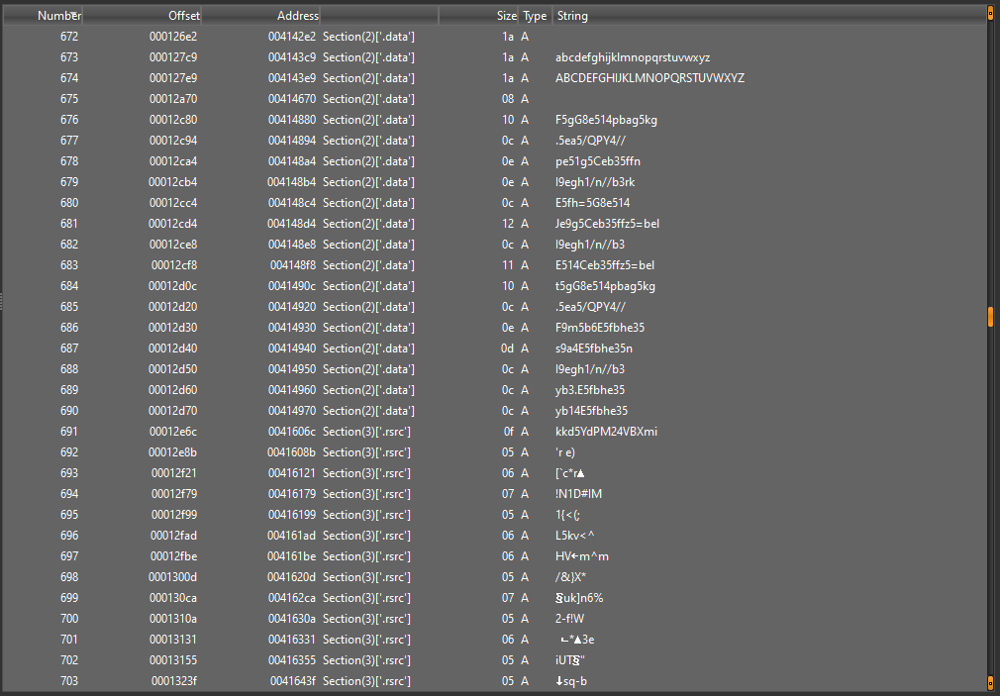
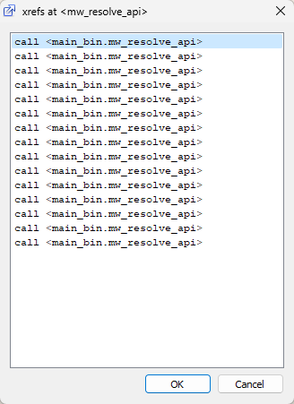
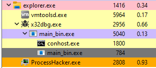
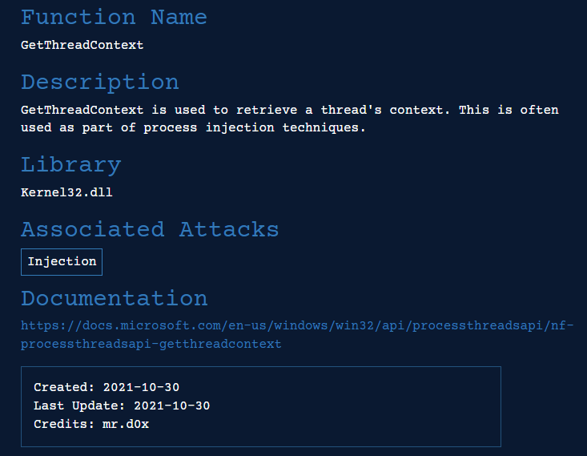
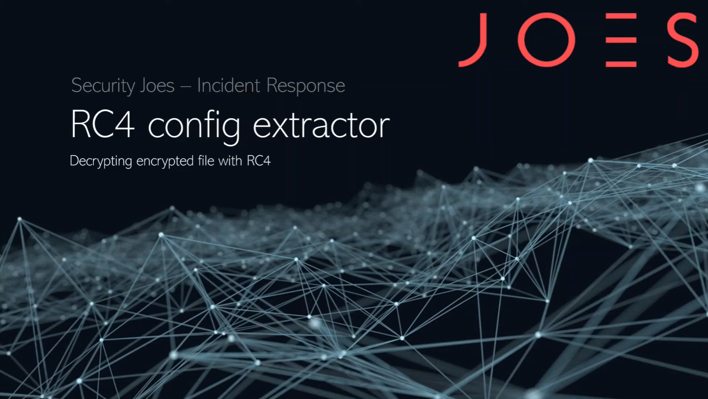
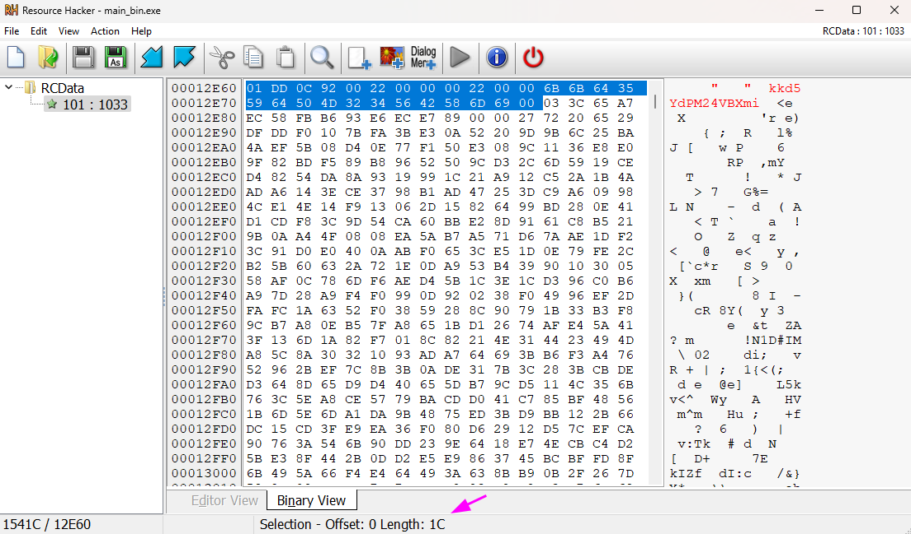
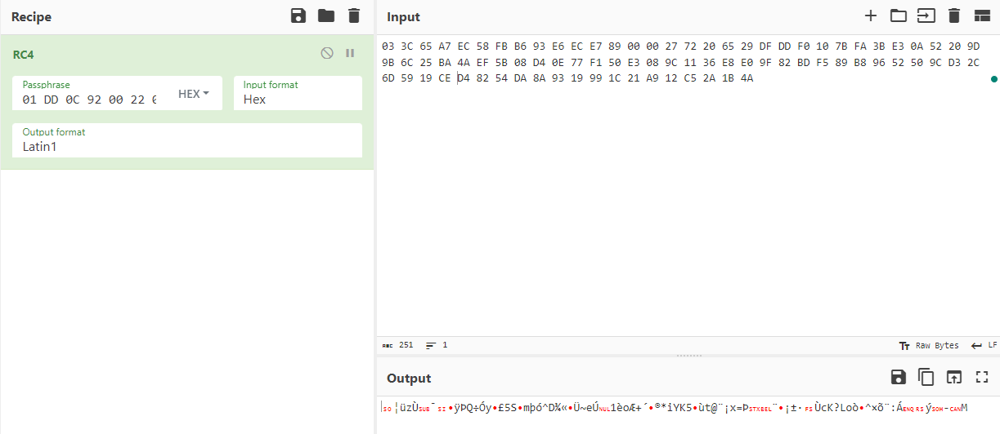
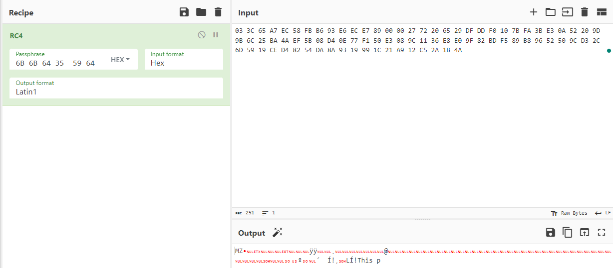

# Zero2Auto - Custom Sample - Part 1

## The IR Case
> Hi there,
>
>During an ongoing investigation, one of our IR team members managed to locate an unknown sample on an infected machine belonging to one of our clients. We cannot pass that sample onto you currently as we are still analyzing it to determine what data was exfilatrated. However, one of our backend analysts developed a YARA rule based on the malware packer, and we were able to locate a similar binary that seemed to be an earlier version of the sample we're dealing with. Would you be able to take a look at it? We're all hands on deck here, dealing with this situation, and so we are unable to take a look at it ourselves.
We're not too sure how much the binary has changed, though developing some automation tools might be a good idea, in case the threat actors behind it start utilizing something like Cutwail to push their samples.
I have uploaded the sample alongside this email.
>
>Thanks, and Good Luck!

## Triage
Let's start looking at this binary to see what information we can collect to create our hypothesis. DiE tells us that we are dealing with a 32-bit binary compiled with Microsoft Visual Studio, and the language is C/C++. Also, it has Anti-Debugger protection.



When we are looking at a binary, it is not recommended to use only one thing as evidence; I mean, we need to be sure that, for example, this sample has any kind of protection. To be sure about it, we can use - besides the automatic scan from DiE.

1. A high entropy means that something higher than 7.2 is suspicious.
2. A small number of readable strings is also suspicious.
3. A small number of imports could indicate a packed program.
4. The difference between disk and memory can also be used as an indicator.

Here we can see that the [entropy](https://redcanary.com/blog/threat-hunting-entropy/) for the **```.rsrc```** section is **```7.9```**. DiE helps us by telling us that it is packed - and at this point, I totally agree.



Following the steps to validate our binary, we can identify a small number of readable strings and some weird strings as shown in the image below. This could be a good indicator that strings are created in runtime, or that there is any kind of obfuscation here, as we don't know yet it is just an indicator that should be validated.



Also, we have here just one import. Looks really suspicious to me, we can keep taking a look at other points, but for me, at this point, we have some interesting things here to investigate and validate. My hypothesis now, based on the triage is:


1. The program is with some kind of packing.
2. We have a resource that probably will be used and it is also packed.
3. Just one import raises a red flag for me, probably other imports would be resolved in run time.

So, let's validate it! :)

## Analysis

As I'm starting to learn how to use [Binary Ninja](https://binary.ninja/), I will use it to help in my analysis process. At the beginning of the analysis, Binja already helped me by telling me that the strings that we saw with **```DiE```** raised some hypotheses for me; now I have the evidence that this will be resolved in runtime, and it looks like encrypted or obfuscated APIs.

Why? Simple! We have here **```GetProcAddress```** and **```LoadLibrary```**. Usually, these APIs are used largely to load a DLL (in our case, **```kernel32.dll```**, as shown in the triage part), and **```GetProcAddress```** is used to get the address of a passed function. The question here is, what is the name passed? We can then follow two paths:

1. Debugging it and seeing the names.
2. Creating a script to resolve the name for us.


So, the second option looks gorgeous, but by now, let me just get the names using x64dbg. In a second moment, I can create it and add it to this analysis.

First of all, I renamed the address **```0x00401300```** to **```mw_resolve_api```** on Binja and now I'm looking at this address on the dbg.

Not only do good things happen when we are reversing something, but sometimes we have to deal with destiny. In this case, we will not need much. We can rebase our binja to get the correct address, we can remove [ASLR](https://www.sans.org/blog/dealing-with-aslr-when-analyzing-malware-on-windows-8-1/) with our **```x64dbg```**, but I will just set the address without the base address. Look, I'm getting this error.


Because in my dbg the base address is not **```0x00400000```**, we can confirm it by taking a look on **```Memory Map```** and then, we see that my base is **```0x009F0000```**.


What should I do? Just use **```0x009F1300```**, easy and now I can rename this function as **```mw_resolve_api```**. All good now! :)


Now, I would like to see where this function is called; I just need to press **```x```** on the line above - that is the beginning of this function - and I will see the cross references.



Doubling click on the first call and setting a BP on it, we can now start our debugging and get all the names after passing by this call.

> A quick explanation here!
>
> When we are working with C/C++, usually, the calling convention here tells us that the function return will be present in EAX. Based on that, we execute the function and take a look at EAX to see the result. Easy, no?

To summarize, let me put here just the translations.

| Before             | After             |
| -----------------  | ----------------- |
| F5gG8e514pbag5kg   | SetThreadContext   |
| .5ea5/QPY4//       | kernel32.dll       |
| pe51g5Ceb35ffn     | CreateProcessA     |
| I9egh1/n//b3rk     | VirtualAllocEx     |
| E5fh=5G8e514       | ResumeThread       |
| Je9g5Ceb35ffz5=bel | WriteProcessMemory |
| I9egh1/n//b3       | VirtualAlloc       |
| E514Ceb35ffz5=bel  | ReadProcessMemory  |
| t5gG8e514pbag5kg   | GetThreadContext   |
| F9m5b6E5fbhe35     | SizeofResource     |
| s9a4E5fbhe35n      | FindResourceA      |
| yb3.E5fbhe35       | LockResource       |
| yb14E5fbhe35       | LoadResource       |

Yeah! Now we can see that we will find exciting things being made with the resource and memory; just looking at these APIs, we can already imagine that something might be injected, and it seems like the resource. The next step for me is to pay attention to the **```VirtualAlloc```** and **```VirtualAllocEx```** and all the **```resource```** APIs.

Using the dbg and knowing that the functions would be resolved at runtime, the program at the beginning calls **```CreateProcessA```**


As we can see here on the [MSDN](https://learn.microsoft.com/en-us/windows/win32/api/processthreadsapi/nf-processthreadsapi-createprocessa) definition. 

```
BOOL CreateProcessA(
  [in, optional]      LPCSTR                lpApplicationName,
  [in, out, optional] LPSTR                 lpCommandLine,
  [in, optional]      LPSECURITY_ATTRIBUTES lpProcessAttributes,
  [in, optional]      LPSECURITY_ATTRIBUTES lpThreadAttributes,
  [in]                BOOL                  bInheritHandles,
  [in]                DWORD                 dwCreationFlags,
  [in, optional]      LPVOID                lpEnvironment,
  [in, optional]      LPCSTR                lpCurrentDirectory,
  [in]                LPSTARTUPINFOA        lpStartupInfo,
  [out]               LPPROCESS_INFORMATION lpProcessInformation
);
```

The 4th param is 4. According to MSDN, the process flags set on [deCreationFlags](https://learn.microsoft.com/en-us/windows/win32/procthread/process-creation-flags) should be created in a suspended state.


> Another quick explanation here!
>
> Usually, a program that is created in a suspended state is preparing itself to receive injected code. Usually, it is done by **```VirtualAlloc(Ex)```** + **```VirtualProtect(Ex)```**.

Using Process Hacker to confirm it, we are able to see that after executing the **```CreateProcessA```**, another binary is created, and the color is set to gray.




> Another quick explanation here!
>
> You can see the color definition in Process Hacker by the menu:
>- Hacker > Options > Highlight


As the process was created and **```EAX```** returns **```1```**, we can keep our analysis. After that **```VirtualAlloc```** is called and the return address is **```0x00DB0000```**. Just put it on dump by following the right-click on **```EAX > Follow in Dump```**. After that **```GetThreadContext```** is called. Let's take a look at what this API is used for.

This time I'm using another good place to learn about APIs, the [MalAPI](https://malapi.io/winapi/GetThreadContext) tells us.



To be honest, nothing new, right? We have already put an injection as a feasible hypothesis. The handle passed to this function was **```0x110```**, and we can see that it is related to our new instance. How can I know that? Simple! Looking for the **```PID```**, is the same ;P


We are finding interesting things here, let's move on. After that there is a call to **```ReadProcessMemory```**. And, according to [MSDN](https://learn.microsoft.com/en-us/windows/win32/api/memoryapi/nf-memoryapi-readprocessmemory).

```
BOOL ReadProcessMemory(
  [in]  HANDLE  hProcess,
  [in]  LPCVOID lpBaseAddress,
  [out] LPVOID  lpBuffer,
  [in]  SIZE_T  nSize,
  [out] SIZE_T  *lpNumberOfBytesRead
);
```

Here we have the params, the **```hProcess```**, **```lpBaseAddress```** and **```lpBuffer```**.


Let's summarize after that, OK? It calls **```VirtualAllocEx```** to allocate memory in this new binary created, and calls **```WriteProcessMemory```** to put the new content there and calls **```SetThreadContext```** and then, **```ResumeThread```**. Nice, we are done, right? We saw everything, and we understood things there, so we finished! 

NOOOOOO lol, we haven't finished here yet. Although the program ends after that, we missed some important things here. Let me refresh the details that we've missed. We didn't see anything related to the resource, and we saw that there is a packed resource. Also, we didn't see the content that was injected there; why? Because we missed essential details and now, we will start from the point where we stopped.

Now we know what and how to do things, so. Let's start it again.

## Now, the TRUE analysis

Okay, to speed up our process, we don't need to see everything again; just put a BP on **```VirtualAlloc```**, **```VirtualAllocEx```**, **```FindResourceA```** and **```LoadResource```**. With all needed BP sets, just run.


The program first stops at the **```FindResource```** and after that, a call to **```LoadResource```**, and it results in the resource file loaded at the address **```0x00A06060```** as the image below.


After that **```VirtualAlloc```** is called and in sequence we have a function which receives three arguments. Put all them on dump we have:


1. The address allocated with **```VirtualAlloc```**
2. A weird content
3. The value **```0x015400```**

Breaking it down, we can see on the assembly code some interesting thing.

```
009F151D | 8985 F0FEFFFF            | mov dword ptr ss:[ebp-110],eax       |
009F1523 | 57                       | push edi                             | Arg3 = edi:EntryPoint
009F1524 | 8D4B 1C                  | lea ecx,dword ptr ds:[ebx+1C]        |
009F1527 | 51                       | push ecx                             | Arg2 = ecx:EntryPoint
009F1528 | 50                       | push eax                             | Arg1
009F1529 | E8 82180000              | call <main_bin.sub_9F2DB0>           | sub_9F2DB0
```

When ECX receives the content from EBX we have here 0x1C, the size from the resource is 0x1541C, the weird value is **```0x015400```**, coincident? I don't think so. And my dear friend, I can tell you why, it doesn't appears by voices in my head, it is because after this code I can see this other code here.

```
009F1546 | 33C0                     | xor eax,eax                          |
009F1548 | 0F1F8400 00000000        | nop dword ptr ds:[eax+eax],eax       |
009F1550 | 888405 F8FEFFFF          | mov byte ptr ss:[ebp+eax-108],al     |
009F1557 | 40                       | inc eax                              |
009F1558 | 3D 00010000              | cmp eax,100                          |
009F155D | 7C F1                    | jl main_bin.9F1550                   |
009F155F | 8BBD ECFEFFFF            | mov edi,dword ptr ss:[ebp-114]       |
009F1565 | 33F6                     | xor esi,esi                          |
009F1567 | 66:0F1F8400 00000000     | nop word ptr ds:[eax+eax],ax         |
009F1570 | 8A9C35 F8FEFFFF          | mov bl,byte ptr ss:[ebp+esi-108]     |
009F1577 | B8 89888888              | mov eax,88888889                     |
009F157C | F7E6                     | mul esi                              |
009F157E | 8BC6                     | mov eax,esi                          |
009F1580 | C1EA 03                  | shr edx,3                            |
009F1583 | 8BCA                     | mov ecx,edx                          |
009F1585 | C1E1 04                  | shl ecx,4                            |
009F1588 | 2BCA                     | sub ecx,edx                          |
009F158A | 2BC1                     | sub eax,ecx                          |
009F158C | 8D8D F8FEFFFF            | lea ecx,dword ptr ss:[ebp-108]       |
009F1592 | 0FB64438 0C              | movzx eax,byte ptr ds:[eax+edi+C]    |
009F1597 | 02C3                     | add al,bl                            |
009F1599 | 02F8                     | add bh,al                            |
009F159B | 0FB6C7                   | movzx eax,bh                         |
009F159E | 03C8                     | add ecx,eax                          |
009F15A0 | 0FB601                   | movzx eax,byte ptr ds:[ecx]          |
009F15A3 | 888435 F8FEFFFF          | mov byte ptr ss:[ebp+esi-108],al     |
009F15AA | 46                       | inc esi                              |
009F15AB | 8819                     | mov byte ptr ds:[ecx],bl             |
009F15AD | 81FE 00010000            | cmp esi,100                          |
009F15B3 | 7C BB                    | jl main_bin.9F1570                   |
009F15B5 | 8BBD E8FEFFFF            | mov edi,dword ptr ss:[ebp-118]       |
009F15BB | 33F6                     | xor esi,esi                          |
009F15BD | 8A7D F8                  | mov bh,byte ptr ss:[ebp-8]           |
009F15C0 | 8A4D F9                  | mov cl,byte ptr ss:[ebp-7]           |
009F15C3 | 85FF                     | test edi,edi                         |
009F15C5 | 7E 56                    | jle main_bin.9F161D                  |
009F15C7 | 66:0F1F8400 00000000     | nop word ptr ds:[eax+eax],ax         |
009F15D0 | FEC7                     | inc bh                               |
009F15D2 | 8D95 F8FEFFFF            | lea edx,dword ptr ss:[ebp-108]       |
009F15D8 | 0FB6C7                   | movzx eax,bh                         |
009F15DB | 03D0                     | add edx,eax                          |
009F15DD | 8A1A                     | mov bl,byte ptr ds:[edx]             |
009F15DF | 02CB                     | add cl,bl                            |
009F15E1 | 0FB6C1                   | movzx eax,cl                         |
009F15E4 | 888D F7FEFFFF            | mov byte ptr ss:[ebp-109],cl         |
009F15EA | 8D8D F8FEFFFF            | lea ecx,dword ptr ss:[ebp-108]       |
009F15F0 | 03C8                     | add ecx,eax                          |
009F15F2 | 0FB601                   | movzx eax,byte ptr ds:[ecx]          |
009F15F5 | 8802                     | mov byte ptr ds:[edx],al             |
009F15F7 | 8819                     | mov byte ptr ds:[ecx],bl             |
009F15F9 | 0FB602                   | movzx eax,byte ptr ds:[edx]          |
009F15FC | 8B8D F0FEFFFF            | mov ecx,dword ptr ss:[ebp-110]       |
009F1602 | 02C3                     | add al,bl                            |
009F1604 | 0FB6C0                   | movzx eax,al                         |
009F1607 | 0FB68405 F8FEFFFF        | movzx eax,byte ptr ss:[ebp+eax-108]  |
009F160F | 30040E                   | xor byte ptr ds:[esi+ecx],al         |
009F1612 | 46                       | inc esi                              |
009F1613 | 8A8D F7FEFFFF            | mov cl,byte ptr ss:[ebp-109]         |
009F1619 | 3BF7                     | cmp esi,edi                          |
009F161B | 7C B3                    | jl main_bin.9F15D0                   |
```

And for me, it looks like [RC4 Cipher](https://en.wikipedia.org/wiki/RC4). I have already dealt with it in an old video that you can find it here.

[](https://www.youtube.com/watch?v=-Kk-r5NxtSA "RC4 Extractor")

Based on that, this difference looks like the RC4 Key and the rest that should be decoded, using [cyberchef](https://cyberchef.org/) when can easily validate it.



I have the possible key:
>01 DD 0C 92 00 22 00 00 00 22 00 00 6B 6B 64 35 59 64 50 4D 32 34 56 42 58 6D 69 00

And I got just some bytes to validate if it is correct.


>03 3C 65 A7 
EC 58 FB B6 93 E6 EC E7 89 00 00 27 72 20 65 29 
DF DD F0 10 7B FA 3B E3 0A 52 20 9D 9B 6C 25 BA 
4A EF 5B 08 D4 0E 77 F1 50 E3 08 9C 11 36 E8 E0 
9F 82 BD F5 89 B8 96 52 50 9C D3 2C 6D 59 19 CE 
D4 82 54 DA 8A 93 19 99 1C 21 A9 12 C5 2A 1B 4A 

Unfortunately, it didn't work, so sad, no?



Not really, just keeping taking a look on dbg we can see that it does not use the **```0x1C```**; it starts by the **```0xC```** position, so our key was almost correct, but we found out that the correct one is with only **```0xF```** bytes.


Very cool, isn't it? Trying this key one more time, we got the correct and beautiful **```MZ```** <3



And now, we know...


After that, happens the same as we've previously analyzed it. We should now analyze this resource! But, it will be in the next part of this **```Zero2Auto Custom Sample```** series.

Thank you for reading until here! See you around! :)